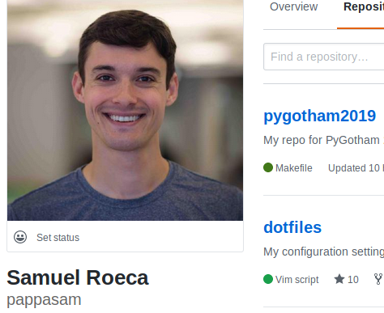
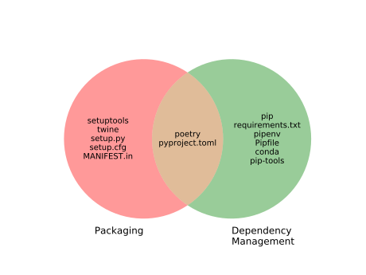

:title: PyGotham 2019
:author: Samuel Roeca
:date: October 5, 2019
:abstract: Have you struggled with setuptools, Pipenv, pip, requirements.txt, and finally just given up on your dreams of distributing your awesome new artificial intelligence / NLP library? Do you think there should be a better way to initialize, evolve, and eventually share your awesome library or application? Have you played around with Rust and wondered whether Python would ever get something as beautiful as Cargo for itself? If any of these questions describes you, then let me tell you about Poetry...
:css: style.css
:skip-help: true
:data-transition-duration: 0

----

:data-x: r2000
:data-y: r0

Poetry
======

Dependency management + packaging made easy!

.. image:: https://raw.githubusercontent.com/sdispater/poetry/master/assets/install.gif
    :width: 800px
    :alt: Poetry in action

Speaker: Samuel Roeca

.. note::

    PyPI: pronounced "Pie P I", NOT "Pie Pie"

----

Agenda
======

.. class:: center-block

* Intro / story from RL
* Jargon, explained
* History: dependency management and packaging
* Poetry: features and interface
* Examples:

    * Dependency management with Poetry
    * Packaging without Poetry
    * Packaging with Poetry

----

About Me (Samuel Roeca)
=======================

|sam_roeca_github| |tux| |nyc_vim_meetup|

|kepler| |kepler_hawaii|

.. |kepler_hawaii| image:: https://media.glassdoor.com/l/85/2f/09/36/kepler-love-in-hawaii.jpg
    :height: 300px
    :alt: Kepler Hawaii!

.. |tux| image:: https://upload.wikimedia.org/wikipedia/commons/3/35/Tux.svg
    :height: 300px
    :width: 300px
    :alt: Tux, the Linux mascot

.. |nyc_vim_meetup| image:: https://secure.meetupstatic.com/photos/event/d/e/5/0/600_343796912.jpeg
    :height: 300px
    :width: 300px
    :alt: NYC Vim Meetup

----

Some Python I've Written
========================

.. class:: center-block

* latexbuild (2016, with setuptools)
* toml-sort (2019, with poetry)
* jedi-languageserver (2019, with poetry)
* pygotham2019 (2019, with hovercraft / poetry)

.. class:: citation

toml-sort: https://pypi.org/project/toml-sort/ , jedi-languageserver: https://pypi.org/project/jedi-language-server/ , latexbuild: https://pypi.org/project/latexbuild/

----

About Sébastien Eustace
=======================

|sebastien_github|

.. class:: center-block

* Poetry: sdispater/poetry (2018)
* Tomlkit: sdispater/tomlkit (2018)

**Disclaimer: I did not write Poetry**

.. |sebastien_github| image:: https://avatars3.githubusercontent.com/u/555648?s=400&v=4
    :height: 300px
    :width: 300px
    :alt: Sébastien Eustace, GitHub

.. |sebastien_linkedin| image:: https://media.licdn.com/dms/image/C4E03AQH8Qt8V4jqrXg/profile-displayphoto-shrink_200_200/0?e=1573084800&v=beta&t=TW_P7uFBV8VnXqK2XF-N_RECUt2tiSV7G-0bhHdP0ec
    :height: 300px
    :width: 300px
    :alt: Sébastien Eustace, Linkedin

----

Jargon
======

.. image:: https://upload.wikimedia.org/wikipedia/commons/6/66/Dictionary_SA_2015_.jpg
    :height: 600px

.. class:: citation

By Sabbir Ahmed - Own work, CC BY-SA 4.0, https://commons.wikimedia.org/w/index.php?curid=63428234

----

Python stuff (simplified)
=========================

.. class:: center-block

* **Module:** a file containing Python code
* **Package:** a directory of Python modules
* **Distribution:** an archived module/package (tar, whl, etc)

.. code:: console

    my-distribution/
    ├── dist
    │   └── my-distribution-0.1.0.tar.gz
    └── my_package
        ├── __init__.py
        └── my_module.py

    $ pip install my-distribution

.. class:: citation

    Simplified version of https://docs.python.org/3/tutorial/modules.html

.. note::

    PSF's treatment of "package" is inconsistent in docs.

----

Dependency management
=====================

.. image:: https://cdn.stocksnap.io/img-thumbs/960w/0BDFNIEMFZ.jpg
    :height: 600px
    :alt: Image of paint in pallet

.. class:: citation

Photographer: Steve Johnson

.. note::

    Process of installing, upgrading, configuring, and removing Python distributions used by your project in a consistent manner. -Wikipedia

----

Packaging
=========

.. image:: https://cdn.stocksnap.io/img-thumbs/960w/EDDBC2KSAS.jpg
    :height: 600px
    :alt: man wrapping, and giving away, a present

.. class:: citation

Photographer: Bruce Mars

.. note::

    Process of creating and uploading a Python distribution to be used by yourself and/or others.

----

History: dependency management + packaging
==========================================

.. container:: row

    .. class:: column

    +---------------------------+
    | **Antiquity** (1990-2008) |
    +---------------------------+
    | * 1990: Floppy disks?     |
    | * 2000: Distutils         |
    | * 2003: PyPI              |
    | * 2004: Setuptools        |
    | * 2007: Virtualenv        |
    | * 2008: Pip               |
    +---------------------------+

    .. class:: column substep

    +------------------------------+
    | **Middle Ages** (2011-2015)  |
    +------------------------------+
    | * 2011: PyPA organization    |
    | * 2012: Conda                |
    | * 2012: pip-tools, PyBuilder |
    | * 2013: Wheel                |
    | * 2014: PEP 440 (~SemVer)    |
    | * 2015: Pypi standards       |
    +------------------------------+

    .. class:: column substep

    +----------------------------+
    | **Modern Era** (2016-2019) |
    +----------------------------+
    | * 2016: Pyproject.toml     |
    | * 2017: Independent builds |
    | * 2017: Pipenv created     |
    | * 2018: Poetry created     |
    | * 2019: Pip, hella changes |
    | * 2019: PyGotham 2019      |
    +----------------------------+

.. class:: citation

https://www.pypa.io/en/latest/history/,
https://en.wikipedia.org/wiki/Anaconda_(Python_distribution),
https://github.com/sdispater/poetry,
https://github.com/jazzband/pip-tools

.. note::

    Check out Dustin Ingram's - Inside the Cheeseshop: How Python Packaging Works - PyCon 2018

    * Below from: https://www.youtube.com/watch?v=AQsZsgJ30AE
    * PIP = Pip installs Python
    * Wheel comes from a cheese wheel, in a cheese shop
    * Comes from tying up packages with twine before sending them

    PEP 517 -- A build-system independent format for source trees

    PEP 518 -- Specifying Minimum Build System Requirements for Python Projects

    Mad props to everyone involved in getting us where we are today. We're in a much better world than in 1990.

    * Pip releases:
    * 2019: 10 releases through August 25, 2019
    * 2018: 6 releases
    * 2017: 0 releases

----

Poetry compared to ecosystem (simplified)
=========================================

.. note::

    * Tools on left are good at Packaging
    * Tools on right are good at dependency management
    * Setuptools / setup.py can be a packager

    "Pipenv is primarily meant to provide users and developers of applications with an easy method to setup a working environment. For the distinction between libraries and applications and the usage of setup.py vs Pipfile to define dependencies, see ☤ Pipfile vs setup.py." From https://docs.pipenv.org/en/latest/

    Not mentioned:

    * PyBuilder: don't know much about it, haven't found many modern opinions.

----

Poetry features: hella
======================

.. class:: center-block

* **add** dependencies
* **remove** dependencies
* **install** dependencies
* **lock** dependencies (poetry.lock)
* Scaffolding for **new** projects
* **export** lockfile to other formats
* **build** packages
* **publish** packages to pypi
* virtualenv management

----

Poetry interface: familiar
==========================

.. container:: row

    .. class:: column

    .. code:: console

        $ poetry --help

        add      Add a new dep...
        build    Builds a pack...
        check    Checks the va...
        init     Creates a bas...
        install  Installs the ...
        new      Creates a new...
        publish  Publishes a p...
        run      Runs a comman...
        update   Update depend...

    .. class:: column substep

    .. code:: console

        $ cargo --help

        ...
        build    Compile ...
        check    Analyze ...
        init     Create a...
        install  Install ...
        new      Create a...
        publish  Package ...
        run      Run a bi...
        update   Update d...

    .. class:: column substep

    .. code:: console

        $ yarn --help

        add
        ...
        check
        init
        install
        ...
        publish
        run
        upgrade

.. note::

    Common commands are preserved. Poetry provides commands not found in Yarn or Cargo; the reverse is also true.

----

Dependency management: a walk in the park
=========================================

.. image:: https://upload.wikimedia.org/wikipedia/commons/d/d8/A_Walk_in_the_park.JPG
    :height: 700px
    :alt: People walking in a park

.. class:: citation

By Cathy J - Own work, CC BY-SA 3.0, https://commons.wikimedia.org/w/index.php?curid=20599656

.. note::

    This trivializes the problem, which isn't quite fair.

    The point: dependency management is solved by both Pipenv and Poetry.

----

.. container:: row

    .. class:: column

    **PyPa tutorial: Pipenv**

    .. class:: column

    **Poetry**

.. container:: row

    .. class:: column

    .. code:: console

        $ pipenv --python 3.7
        $ pipenv install flask
        $ pipenv install --dev pylint
        $ tree .
        .
        ├── Pipfile
        └── Pipfile.lock

    .. class:: column substep

    .. code:: console

        $ poetry init -n
        $ poetry add flask
        $ poetry add --dev pylint
        $ tree .
        .
        ├── poetry.lock
        └── pyproject.toml

.. class:: substep

Both Poetry **and** Pipenv make managing dependencies and virtualenvs easy.

.. note::

    They're slightly different in Pipfile / pyproject.toml, but let's not dwell. They're both great pieces of software for dependency management.

----

Packaging: an odyssey
=====================

.. image:: https://upload.wikimedia.org/wikipedia/commons/e/ec/Arnold_B%C3%B6cklin_-_Odysseus_and_Polyphemus.jpg
    :width: 1500px
    :alt: The Cyclops throwing stones at a boat

.. class:: citation

By Arnold Böcklin - Sotheby's London, 11 June 2012, lot 8 (has longer description), Public Domain, https://commons.wikimedia.org/w/index.php?curid=19582047

----

Warm-up: use a distributed package!
===================================

.. code:: console

    $ pip install requests

.. raw:: html

     

.. class:: substep

.. image:: https://upload.wikimedia.org/wikipedia/commons/7/75/The_legendary_meme_creation_aka_bloob_itself.png
    :height: 530px
    :alt: By andreyteslax - Own work, CC0, https://commons.wikimedia.org/w/index.php?curid=67878837

.. note::

    $ pip install requests

    -> Picture of guy going "AYE"

----

Gametime: make a distributed package!
=====================================

.. class:: substep

.. image:: https://upload.wikimedia.org/wikipedia/commons/f/f4/The_Scream.jpg
    :height: 700px
    :alt: Scream painting

.. class:: citation

    By Edvard Munch - National Gallery of Norway, Public Domain, https://commons.wikimedia.org/w/index.php?curid=69541493

----

Packaging considerations
========================

.. class:: center-block

* Project scaffolding / structure
* Manage the project's version
* Manage dependency version requirements
* Manage Python version requirements
* Manage dependencies for local development
* Edit software with a text editor
* Control who can publish new versions
* Build the package
* Publish to Pypi, or some other place
* More stuff I might not be thinking of right now

.. note::

    1. Project scaffolding
    2. Manage 3rd party dependencies
    3. Edit software with a text editor
    4. Build the package
    5. Publish to Pypi

    And probably a million other things I'm forgetting!

----

Packaging: PyPa tutorial
========================

1. Manually create a project structure
======================================

.. code:: text

    packaging_tutorial/
      example_pkg/
        __init__.py
      setup.py
      LICENSE
      README.md

.. note::

    Assume we've filled out the LICENSE and README

----

2. Manually write setup.py
==========================

.. code:: python

    import setuptools

    with open("README.md", "r") as fh:
        long_description = fh.read()

    setuptools.setup(
        name="example-pkg-your-username",
        version="0.0.1",
        author="Example Author",
        author_email="author@example.com",
        description="A small example package",
        long_description=long_description,
        ...,
        python_requires='>=3.6',
    )

.. note::

    setup.py is a Python file. It can contain arbitrary Python code. As such, it can become arbitrarily complex if left up to a developer.

    Developers often tolerate complexity unfortunately well.

----

3. Build distribution with setuptools
=====================================

.. code:: console

    $ pip install setuptools wheel
    $ python3 setup.py sdist bdist_wheel
    $ ls dist

.. class:: substep

.. code:: text

    dist/
      example_pkg-0.0.1-py3-none-any.whl
      example_pkg-0.0.1.tar.gz

----

4. Use tool called twine to upload
==================================

.. code:: console

    $ pip install twine
    $ python -m twine upload dist/*

    Uploading distributions...
    Enter your username: [your username]
    Enter your password:
    ... uploaded

.. note::

    You should explicitly choose the distribution files. Pypi doesn't allow you to re-upload versions and this technique causes errors if you're frequently releasing new versions.

----

5. Study setuptools, twine, etc in spare time
=============================================

.. image:: https://upload.wikimedia.org/wikipedia/commons/d/dc/Studying_%282759729091%29.jpg
    :height: 600px
    :alt: Boys studying

.. class:: citation

By Tulane Public Relations - StudyingUploaded by AlbertHerring, CC BY 2.0, https://commons.wikimedia.org/w/index.php?curid=29679029

.. note::

    We haven't covered the following:

    1. Managing dependencies for local development. I think you'll use a combination of pip, setup.py, and requirements.txt.
    2. The different CLI of setuptools and twine
    3. Anything else we may need to manually do in setup.py
    4. Twine is alternative to setup.py upload. For security reasons.
    5. MANIFEST.in
    6. setup.cfg
    7. Look for perfect setuptools example.

----

6. (most people) Take the blue pill
===================================

.. image:: https://upload.wikimedia.org/wikipedia/commons/5/52/Red_and_blue_pill.jpg
    :height: 600px
    :alt: Red pill and blue pill

.. class:: citation

By W.carter - Own work, CC BY-SA 4.0, https://commons.wikimedia.org/w/index.php?curid=34979655

.. note::

    setuptools has all the flexibility of a general purpose programming language.

    For most new packagers, it presents too many options with functionality documented all over the place.

----

Packaging: with Poetry!
=======================

.. class:: substep

.. code:: console

    $ poetry new my-package
    $ cd my-package
    $ poetry build
    $ poetry publish

.. raw:: html

     

.. class:: substep

.. image:: https://upload.wikimedia.org/wikipedia/commons/7/75/The_legendary_meme_creation_aka_bloob_itself.png
    :height: 400px
    :alt: By andreyteslax - Own work, CC0, https://commons.wikimedia.org/w/index.php?curid=67878837

----

1. Project scaffolding
======================

.. code:: console

    $ poetry new my-package

.. class:: substep

.. code:: text

    my-package/
    ├── my_package
    │   └── __init__.py
    ├── pyproject.toml
    ├── README.rst
    └── tests
        ├── __init__.py
        └── test_my_package.py

.. note::

    Now change directories into my-package for remaining commands.

----

2. Dependency management: add
=============================

.. code:: console

    $ poetry add requests

.. class:: substep

.. code:: text

    Creating venv my-package-PgT-TJDm-py3.7
    Using version ^2.22.0 for requests
    Updating dependencies
    Resolving dependencies... (1.3s)
    Writing lock file
    Package operations:
        14 installs, 0 updates, 0 removals
      - Installing more-itertools (7.2.0)
      - ...
      - Installing urllib3 (1.25.3)
      - Installing requests (2.22.0)

.. note::

    Output slightly modified to fit on screen.

----

3. Edit software
================

.. code:: console

    $ YOUR_EDITOR ./my_package/hello.py

.. class:: substep

.. code:: python

    import requests

    URL = "https://api-with-great-advice.com"

    def world(statement, noun):
        """Hello world, with a twist"""
        json_result = requests.get(URL).json()
        advice = json_result["advice"]
        return ("Hello, world! "
                f'"{statement}", {noun}. '
                f"{advice}")

.. note::

    Choose your favorite text editor for this bit

----

4. Build a distribution
=======================

.. code:: console

    $ poetry build

.. class:: substep

.. code:: text

    Building my-package (0.1.0)
     - Building sdist
     - Built my-package-0.1.0.tar.gz

     - Building wheel
     - Built my_package-0.1.0-py3-none-any.whl

----

5. Publish distribution
=======================

.. code:: console

    $ poetry publish

.. class:: substep

.. code:: text

    Publishing my-package (0.1.0) to PyPI
    Username: my-pypi-username
    Password: ******************************
     - Uploading my-package-0.1.0.tar.gz 100%

----

Dependency management: pyproject.toml
=====================================

.. code:: toml

    [tool.poetry]
    name = "poetry-project"
    version = "0.1.0"
    description = "My great project"
    authors = ["Sam Roeca <samuel.roeca@gmail.com>"]

    [tool.poetry.dependencies]
    python = "^3.7"
    flask = "^1.1.1"

    [tool.poetry.dev-dependencies]
    pylint = "^2.3.1"

    [tool.poetry.scripts]
    poetryproject = 'poetry_project.cli:cli'

.. note::

    * Separates runtime dependencies from dev-dependencies
    * It's so clear it's almost boring
    * File is autogenerated; studying is much easier with a template

----

Semantic Versioning: ranges like NodeJs
=======================================

.. class:: center-block

+--------------+-----------+-----------+-----------+
| **Version**  | **Major** | **Minor** | **Patch** |
+--------------+-----------+-----------+-----------+
| 8.9.10       | 8         | 9         | 10        |
+--------------+-----------+-----------+-----------+
| 7.100.123123 | 7         | 100       | 123123    |
+--------------+-----------+-----------+-----------+

.. class:: center-block

* Patch release range: ~1.0.4 (setuptools: ">=1.0.4,<1.1.0")
* Minor release range: ^1.0.4 (setuptools: ">=1.0.4,<2.0")

.. class:: citation

https://semver.npmjs.com/

.. note::

    * MAJOR: incompatible API changes
    * MINOR: add backwards-compatible functionality
    * PATCH: backwards compatible bug fixes
    * Compatible with PEP 440: Version Identification and Dependency Specification

    https://semver.org/spec/v2.0.0.html

    * Helpful syntax for semantic versioning; eliminates redundancy; ^

----

Locked dependencies: poetry.lock
================================

.. code:: toml

    [[package]]
    category = "main"
    description = "Various helpers..."
    name = "itsdangerous"
    optional = false
    python-versions = ">=2.7, !=3.0..."
    version = "1.1.0"

    [[package]]
    category = "main"
    description = "A small but fastthon..."
    name = "jinja2"
    optional = false
    python-versions = "*"
    version = "2.10.1"

----

Why Poetry?
===========

.. image:: https://upload.wikimedia.org/wikipedia/commons/1/1c/Joseph_Brodsky_1988.jpg
    :height: 250px
    :alt: By Anefo / Croes, R.C. - [1] Dutch National Archives, The Hague, Fotocollectie Algemeen Nederlands Persbureau (ANEFO), 1945-1989 Bestanddeelnummer 934-3497, CC BY-SA 3.0 nl, https://commons.wikimedia.org/w/index.php?curid=20440470

.. code:: text

    Poetry amounts to
    arranging words
    with the greatest specific gravity
    in the most
    effective and externally inevitable
    sequence.
    -Joseph Brodsky

.. class:: citation

Brodsky photo: by Anefo / Croes, R.C. - [1] Dutch National Archives, The Hague, Fotocollectie Algemeen Nederlands Persbureau (ANEFO), 1945-1989 Bestanddeelnummer 934-3497, CC BY-SA 3.0 nl, https://commons.wikimedia.org/w/index.php?curid=20440470

.. note::

    This quote is about actual Poetry, not the software project.

    Though, it kind of works for the Poetry project too...

    Maybe that was intentional?

    Source: http://www.tnellen.com/cybereng/poetry.html

----

Why Poetry, the Python project?
===============================

.. image:: https://avatars1.githubusercontent.com/u/3723671?s=460&v=4
    :height: 200px
    :alt: Sam Roeca, from GitHub

.. code:: text

    Poetry HAS
    a slick, familiar interface
    that MAKES
    developing Python packages
    AND applications
    EASY!

----

Alternatives | Poetry
=====================

.. image:: https://upload.wikimedia.org/wikipedia/commons/9/9f/L-Hochrad.png
    :height: 600px
    :alt: penny farthing versus modern bicycle

.. class:: citation

Public Domain, https://commons.wikimedia.org/w/index.php?curid=402170

.. note::

    * Poetry is not perfect, still being perfected
    * It's a better design than the current options
    * Enthusiasts used to old options may be slow to adopt;
    * Is not fundamentally new.
    * Poetry uses setuptools, pip, etc under the hood.

----

If time permits...
==================

1. Live demo: create an application
2. Live demo: create a distributable package

----

Questions?
==========

.. BEGIN: Global directives

.. |html_br| raw:: html

     

.. END: Global directives
